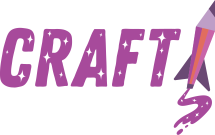

<p align="center">
    
    <br />
</p>

# Craft: Universal Release Tool <!-- omit in toc -->

[](https://github.com/getsentry/craft/releases/latest)
[](https://www.npmjs.com/package/@sentry/craft)
[](https://github.com/getsentry/craft/blob/master/LICENSE)

Craft is a command line tool that helps automate and pipeline package releases. It enforces a specific workflow for managing release branches, changelogs, and artifact publishing.

📚 **[Full Documentation](https://getsentry.github.io/craft/)**

## Quick Start

### Installation

Download the [latest binary release](https://github.com/getsentry/craft/releases/latest), or install via npm:

```shell
npm install -g @sentry/craft
```

### Usage

```shell
# Auto-determine version from conventional commits
craft prepare auto

# Or specify a version explicitly
craft prepare 1.2.3

# Publish to all configured targets
craft publish 1.2.3
```

## Features

- **Auto Versioning** - Automatically determine version bumps from conventional commits
- **Multiple Targets** - Publish to GitHub, NPM, PyPI, Docker, Crates.io, NuGet, and more
- **Changelog Management** - Auto-generate changelogs from commits or validate manual entries
- **Workspace Support** - Handle monorepos with NPM/Yarn workspaces
- **CI Integration** - Wait for CI to pass, download artifacts, and publish
- **GitHub Actions** - Built-in actions for release preparation and changelog previews
- **AI Summaries** - Summarize verbose changelog sections using AI (GitHub Models or local fallback)

## AI-Powered Changelog Summaries

Craft can summarize changelog sections with many entries into concise descriptions. Uses [GitHub Models](https://github.com/marketplace/models) by default, with a local fallback when no token is available.

### Example 1: Craft 2.16.0

**Before (6 items):**
```markdown
### New Features
- Strip commit patterns from changelog entries
- Add support for custom changelog entries from PR descriptions
- Support for multiple entries and nested items
- Add changelog preview action and CLI command
- Make release workflow reusable for external repos
- Add version templating for layer names
```

**After (section summary with expandable details):**
```markdown
### New Features
Changelog entries now support custom descriptions, multiple items, previews, reusable workflows, and version templating for layers.

<details>
<summary>Show 6 items</summary>

- Strip commit patterns from changelog entries
- Add support for custom changelog entries from PR descriptions
- Support for multiple entries and nested items
- Add changelog preview action and CLI command
- Make release workflow reusable for external repos
- Add version templating for layer names

</details>
```

**Top-level summary** (with `topLevel: "always"`):
> The software release includes several new features: the ability to strip commit patterns from changelog entries, support for custom changelog entries derived from pull request descriptions, and support for multiple entries and nested items. Additionally, a changelog preview action and CLI command have been added.

### Example 2: Sentry 25.12.0 (Large Release)

For large releases like [Sentry 25.12.0](https://github.com/getsentry/sentry/releases/tag/25.12.0) with 31+ items:

| Section | Items | Words In → Out | Compression |
|---------|-------|----------------|-------------|
| ACI | 11 | 98 → 41 | **58%** |
| Agents | 8 | 58 → 24 | **59%** |
| Seer & Triage | 12 | 80 → 31 | **61%** |

**Top-level summary** (106 words):
> The latest software release includes several updates across three main areas: ACI, Agents, and Seer & Triage. In the ACI section, the metric monitor form now defaults to the number of errors, and alerts have been updated to include a disabled status and display test notification errors in the UI. The Agents section introduces markdown rendering, the ability to switch to raw values, and a new onboarding process for browser JavaScript. Additionally, the Seer & Triage updates involve changes to support repo type checks, column renaming for broader applicability, and the removal of unnecessary calls.

### Configuration

```yaml
aiSummaries:
  enabled: true
  kickInThreshold: 5  # Only summarize sections with >5 items
  model: "openai/gpt-4o-mini"  # optional, default
  topLevel: "threshold"  # "always" | "never" | "threshold" | true | false
```

#### Top-Level Summary

The `topLevel` option controls whether an executive summary is generated for the entire changelog:

- `"always"` or `true`: Always generate a top-level summary paragraph
- `"never"` or `false`: Never generate a top-level summary
- `"threshold"` (default): Only generate if total items exceed `kickInThreshold`

```yaml
# Always include an executive summary
aiSummaries:
  topLevel: "always"

# Never include an executive summary
aiSummaries:
  topLevel: false

# Only summarize large releases (default behavior)
aiSummaries:
  topLevel: "threshold"
  kickInThreshold: 10  # Only summarize releases with >10 total items
```

### Authentication

The feature uses your GitHub token automatically:
- From `GITHUB_TOKEN` environment variable, or
- From `gh auth token` (GitHub CLI)

If no token is available, Craft falls back to a local model ([Falconsai/text_summarization](https://huggingface.co/Falconsai/text_summarization)).

### Available Models

**GitHub Models** (requires token):

```yaml
aiSummaries:
  model: "openai/gpt-4o-mini"   # Default, 71% compression
  model: "openai/gpt-4o-mini"        # Fast and capable
  model: "openai/gpt-4o"             # Most capable
```

**Local models** (no token needed):

```yaml
aiSummaries:
  model: "local:Falconsai/text_summarization"  # 60MB, extractive
```

## Configuration

Create a `.craft.yml` in your project root:

```yaml
minVersion: "2.0.0"
changelog:
  policy: auto
targets:
  - name: github
  - name: npm
    access: public
```

See the [configuration reference](https://getsentry.github.io/craft/configuration/) for all options.

## Supported Targets

| Target | Description |
|--------|-------------|
| `github` | GitHub releases and tags |
| `npm` | NPM registry (with workspace support) |
| `pypi` | Python Package Index |
| `crates` | Rust crates.io |
| `nuget` | .NET NuGet |
| `docker` | Docker registries |
| `brew` | Homebrew formulas |
| `gcs` | Google Cloud Storage |
| `gh-pages` | GitHub Pages |
| `cocoapods` | CocoaPods |
| `gem` | RubyGems |
| `maven` | Maven Central |
| `hex` | Elixir Hex |
| `pub-dev` | Dart/Flutter pub.dev |
| `aws-lambda-layer` | AWS Lambda layers |
| `powershell` | PowerShell Gallery |

See the [targets documentation](https://getsentry.github.io/craft/targets/) for configuration details.

## GitHub Actions

Craft provides GitHub Actions for automating releases and previewing changelog entries.

### Prepare Release Action

Automates the `craft prepare` workflow in GitHub Actions:

```yaml
name: Release
on:
  workflow_dispatch:
    inputs:
      version:
        description: 'Version to release (or "auto")'
        required: false

jobs:
  release:
    runs-on: ubuntu-latest
    steps:
      - uses: actions/checkout@v4
        with:
          fetch-depth: 0
      - uses: getsentry/craft@v2
        with:
          version: ${{ github.event.inputs.version }}
        env:
          GITHUB_TOKEN: ${{ secrets.GITHUB_TOKEN }}
```

**Inputs:**

| Input | Description | Default |
|-------|-------------|---------|
| `version` | Version to release (semver, "auto", "major", "minor", "patch") | Uses `versioning.policy` from config |
| `merge_target` | Target branch to merge into | Default branch |
| `force` | Force release even with blockers | `false` |
| `blocker_label` | Label that blocks releases | `release-blocker` |
| `publish_repo` | Repository for publish issues | `{owner}/publish` |

**Outputs:**

| Output | Description |
|--------|-------------|
| `version` | The resolved version being released |
| `branch` | The release branch name |
| `sha` | The commit SHA on the release branch |
| `changelog` | The changelog for this release |

### Changelog Preview (Reusable Workflow)

Posts a preview comment on PRs showing how they'll appear in the changelog:

```yaml
name: Changelog Preview
on:
  pull_request:
    types: [opened, synchronize, reopened, edited, labeled]

jobs:
  changelog-preview:
    uses: getsentry/craft/.github/workflows/changelog-preview.yml@v2
    secrets: inherit
```

The workflow will:
- Generate the upcoming changelog including the PR's changes
- Highlight entries from the PR using blockquote style (left border)
- Post a comment on the PR with the preview
- Automatically update when you update the PR (push, edit title/description, or change labels)

## Contributing

See [CONTRIBUTING.md](CONTRIBUTING.md) for development setup and guidelines.

## License

MIT
